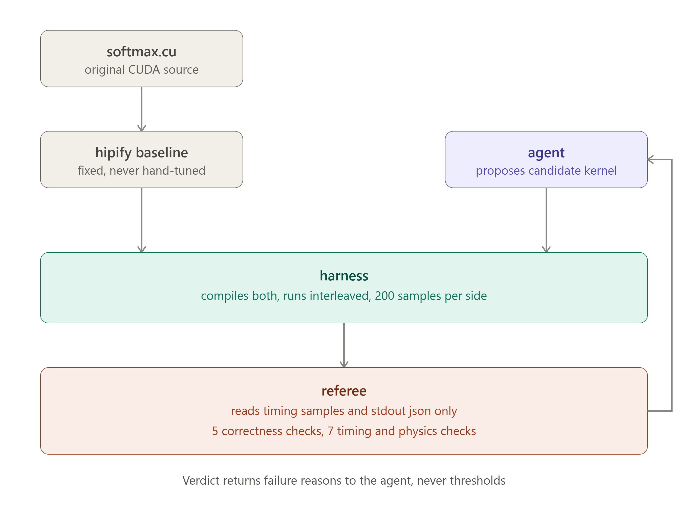

# decuda

An agent that ports and tunes CUDA kernels to AMD HIP, and an independent referee
that decides whether the resulting speedups are real.

---

## The problem: a speedup claim is a claim about measurement

decuda's agent proposes faster HIP kernels. An independent referee decides
whether each claimed speedup is real, using 12 checks it never shares with the
agent.

That separation earned itself immediately. Early in development the referee
accepted a candidate at 75.69x, 8.6 sigma, every correctness check green. An
external profiler put the real figure near 1.75x — the baseline was being timed
differently from the candidate, so the reference looked 41x slower than it was.

Four such asymmetries turned up before the numbers stabilised. Every one made the
baseline look slow; every one was found by an independent profiler rather than by
the referee itself. The final verified result is 1.13x, confirmed at 1.28x by
`rocprofv3`.

| Stage                       | Reported           | After external verification     |
| --------------------------- | ------------------ | ------------------------------- |
| Process wall-clock timing   | nothing could pass | measuring setup, not the kernel |
| After `hipEvent` timing     | 75.69x             | ~1.75x                          |
| After baseline warmup fix   | 1.84x              | inflated by dispatch asymmetry  |
| After matching amortization | **1.13x**          | **1.28x**                       |

The final number is smaller than every number before it. That is the system
working.

---

## **Status:** working end-to-end on rented MI300X hardware (gfx942, ROCm 10.0).

Verified result: 1.13x speedup accepted by the referee, independently confirmed
at 1.28x with `rocprofv3`.

- Agent proposes HIP kernels; an independent referee decides if the speedup is real
- 12 referee checks — 5 correctness, 7 timing and physics
- Agent never sees pass thresholds (enforced by test)
- Every run emits a CSV record, a changelog, and the full agent trajectory

---

## What this is

Most work on AI kernel generation focuses on whether the generated kernel is
_correct_. Correctness is the easier half. The HIPIFY baseline here already
compiles and already produces the right answer — the agent is not fixing it, it
is trying to make it faster.

The hard part is that a claimed speedup is a claim about measurement, and
measurement is exactly where kernel agents have been caught being wrong before
(Sakana's kernel agent reported speedups that did not survive scrutiny).

So decuda separates the two roles:

- **The agent** proposes candidate HIP kernels. It sees the baseline source and
  specific failure reasons from previous attempts.
- **The referee** decides whether a candidate is correct and whether its speedup
  is established. It reads only timing samples and the kernel's stdout JSON.

The agent never sees the pass criteria. It is told _why_ an attempt failed, never
what threshold it would have had to clear. This is enforced by a test
(`test_feedback_leaks_no_thresholds`).

---

## Pipeline

## 

## What the referee checks

**Correctness** (per-kernel):

| Check       | What it establishes                                          |
| ----------- | ------------------------------------------------------------ |
| `execution` | the candidate ran and exited cleanly                         |
| `shape`     | it produced as many elements as the baseline                 |
| `finite`    | no NaN or Inf in the output                                  |
| `magnitude` | max absolute error against a double-precision host reference |
| `row_sums`  | every softmax row sums to 1.0                                |

**Timing** (general across kernels):

| Check                | What it establishes                                           |
| -------------------- | ------------------------------------------------------------- |
| `sample_count`       | enough samples to say anything                                |
| `plausible_duration` | durations are not absurd                                      |
| `not_degenerate`     | the samples actually vary                                     |
| `noise_level`        | measurement is stable enough to support a claim               |
| `warmup`             | early samples were discarded                                  |
| `bandwidth_ceiling`  | the result does not exceed the memory bandwidth of the device |
| `separation`         | the improvement is large relative to measured noise           |

`bandwidth_ceiling` is the only check that can call a result **impossible**
rather than merely unproven. Every other check says "not established." That one
says physics forbids it.

---

## Result

On an AMD Instinct MI300X (gfx942, ROCm 10.0), 200 samples per side, 20 kernel
launches per sample:

- baseline: **6,356 ns** (self-reported), **6,454 ns** (`rocprofv3`) — 1.5% apart
- candidate: **5,648 ns** (self-reported), **5,051 ns** floor (`rocprofv3`)
- **1.13x speedup, 6.1 sigma separation** by the harness
- **1.28x** profiler-minimum to profiler-minimum

Achieved bandwidth 1,498 GB/s, 28% of theoretical peak. The baseline is already
memory-bound and reasonably efficient, so there is no order-of-magnitude win
available here — which is itself a useful thing for a referee to be able to say.

Every accepted number was cross-checked against `rocprofv3`, which measures both
sides by construction and cannot be influenced by what either kernel claims about
itself.

---

## The four measurement bugs

Each one made the baseline look slower than it was, and each was found by the
external profiler rather than by the referee.

**1. Wall time instead of kernel time.** The harness timed the whole process with
`perf_counter` — HIP init, `hipMalloc`, generating a million random floats, the
host reference loop. That is ~183 ms wrapped around a kernel that runs in
microseconds. A genuine 2x kernel improvement moved wall time by roughly 0.005%,
far under the noise floor. Acceptance was arithmetically impossible, not merely
unachieved. Fixed by bracketing the launch with `hipEventRecord` /
`hipEventElapsedTime` and emitting `kernel_ms` in the stdout JSON.

**2. First-launch overhead.** The baseline's single timed launch paid module-load
and code-object setup. The candidate's internal warmup had already paid it. Fixed
with a discarded warmup launch before the timed region. This is the one that
produced the fake 75x.

**3. Cold dispatch queue.** Even with a warmup, ~1.8 µs of dispatch latency sat
inside the baseline's event bracket that the candidate did not pay.

**4. Unequal amortization.** The candidate — on its own initiative, as good
benchmarking practice — timed a loop of 20 launches and divided by 20, so
dispatch cost amortized to nearly nothing. The baseline timed a single launch and
ate all of it. Matching the baseline to the same 20-launch structure closed the
gap to under 2%.

Worth being precise about what happened here: **the agent never manipulated the
baseline and could not have.** The baseline is a fixed file protected by a test.
The candidate reported its own timings accurately every single time it was
checked. The bias was in the harness — the component built to be neutral was not
neutral, and it favoured whichever side happened to benchmark itself more
carefully.

That is a less obvious failure than a dishonest model, and arguably a more
dangerous one, because nobody is watching for it.

---

## Reproducing

You need an AMD gfx942 GPU (MI300X or MI300A). I rented one from DigitalOcean's
GPU droplets at $1.99/hr — any provider works.

**1. Get a machine.** Image: ROCm 10.0 on Ubuntu 24.04. Verify with `rocm-smi`.

**2. Clone and set up.**

```bash
git clone https://github.com/AriBandyo/decuda.git
cd decuda
python3 -m venv decuda_env && source decuda_env/bin/activate
```

No third-party Python packages are required — the API client is plain
`urllib.request` from the standard library. Python 3.11 or newer.

**3. Set your API key.** Start `tmux` first — the export does not survive a
dropped SSH connection, and the run takes a while.

```bash
tmux new -s decuda
export ANTHROPIC_API_KEY=
```

Paste the key _after_ the `=` rather than pasting the whole line; some terminals
mangle the first characters otherwise.

**4. Run it.**

```bash
python3 scripts/run_softmax.py
```

Roughly 5 minutes for 5 iterations. Most of the wall clock is API calls, not GPU
time. Results land in `runs/`.

**5. Verify the numbers independently.** Do not take the harness at its word —
that is the whole lesson above.

```bash
rocprofv3 --kernel-trace --stats --output-format csv \
  --output-directory /tmp/prof -- /tmp/softmax_run/build/softmax_candidate
cat /tmp/prof/*/*_kernel_stats.csv
```

Compare `MinNs` against the `kernel_ms` your run reported. They should agree
within about 10%.

**Gotchas**

- `--offload-arch=gfx942` is required; without it the kernel builds but will not run.
- `--stats` needs `--kernel-trace` alongside it, or rocprofv3 errors out.
- `kernel_ms` measured _under_ the profiler is inflated — profiling serializes
  launches. Quote the profiler's own numbers instead.
- Destroy the machine when done. Powering off still bills.

---

## Outputs

Each run writes to `runs/`:

- `<timestamp>_softmax_iterations.csv` — one row per referee check, with run
  metadata, schema version, and harness version
- `CHANGELOG.md` — baseline-vs-candidate table with the diff summary, evidence,
  and decision for each iteration
- `trajectories/candidate_N.hip.cpp` — every kernel the agent proposed

The CSV schema is versioned separately from the harness so that today's records
still parse against later versions.

---

## Limitations

- **One kernel.** The timing and physics referee is general; correctness needs a
  per-kernel property (`row_sums` is softmax-specific). Each new kernel needs its
  own baseline and its own `bytes_moved`.
- **`NUM_ITERS` is matched by hand.** The baseline currently hardcodes 20
  launches per timed sample to match what the candidates chose. A candidate that
  picked a different value would silently reintroduce measurement asymmetry. The
  referee should assert both sides used the same structure.
- **`bytes_moved` is a theoretical minimum**, so reported bandwidth is an upper
  bound — conservative in the right direction, but not measured traffic.
- **The separation rule is deliberately strict.** It compares the improvement to
  raw single-run spread rather than to the standard error of the means, which is
  a higher bar than a standard significance test. That suits the goal here.
- **Compile failures** are recorded in history but not in the iteration list, so
  they do not appear in the CSV.

---

## Next

- Replace the noise-multiplier separation rule with median difference plus a
  bootstrap confidence interval and an explicit minimum detectable effect, with a
  `CANNOT_MEASURE` verdict when the effect floor is not reachable. Strictly a
  tightening — the referee should only ever move in that direction.
- Record hardware constants as fields rather than assumptions (wavefront size,
  measured peak HBM, compute units, clock lock state) so records from different
  machines are comparable.
- Write roofline position into each record — achieved bandwidth as a fraction of
  measured peak is the transferable signal, not the vendor-specific number.
- Run several models through the same referee and report whether any produce
  claims that fail external verification. The referee is model-agnostic by
  construction: it reads only timing samples and stdout. That makes "does model
  capability correlate with unverifiable claims?" a directly testable question.

---

Built for the micro1 Agentic Workflows Hackathon, August 2026.
